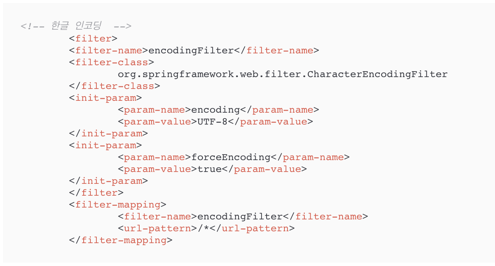

# TomandMay
>스프링 웹 프로젝트

 

## 1.제작 기간 & 참여 인원
* 2022년 9월 1일 ~ 9월16일
* 팀프로젝트 / 2명

 

## 2.사용 기술
* Java 8
* Spring 5.2
* Oracle 
* MyBatis

 

## 3.핵심 기능
* 데이터베이스를 활용해서 기본적인 등록,수정,삭제,조회 기능을 구현
* 웹 화면에서 페이징 처리와 검색 처리
* 다양한 종류의 첨부파일을 웹에 게시
* Ajax를 이용하는 데이터 처리

핵심 기능 설명 펼치기

       

### 3.1 Controller

- **CRUD 처리** :pushpin: [코드 확인](https://github.com/sda607/sunghoon-hong/blob/b7516f692ca87d76e18cf589dbac8be5edd9f554/tamproject2/src/main/java/com/spring/controller/BoardController.java)

- **화면 처리** :pushpin: [코드 확인](https://github.com/sda607/sunghoon-hong/blob/5fe8fecab8d96aeb95cf217e5bf15eb18b28214f/tamproject2/src/main/webapp/WEB-INF/views/board/list.jsp)

- **페이징 처리** :pushpin: [코드 확인](https://github.com/sda607/sunghoon-hong/blob/5fe8fecab8d96aeb95cf217e5bf15eb18b28214f/tamproject2/src/main/webapp/WEB-INF/views/board/list.jsp)

- **검색 처리** :pushpin: [코드 확인](https://github.com/sda607/sunghoon-hong/blob/ef62ae8fe1bf659da0b380e28f0f3c3181ac111c/tamproject2/src/main/resources/com/spring/mapper/BoardMapper.xml)

- **Ajax 댓글 처리** :pushpin: [코드 확인](https://github.com/sda607/sunghoon-hong/blob/aaeeb185d7e865bad760a5c4c5d87bb6dcff4065/tamproject2/src/main/java/com/spring/controller/ReplyController.java)

## 4.핵심 트러블 슈팅
- **목록 페이지와 뒤로 가기 문제** :pushpin: [코드 확인](https://github.com/sda607/sunghoon-hong/blob/33308b4b8b167e3ee4e5c8be845c4d697cc5e159/tamproject2/src/main/webapp/WEB-INF/views/board/list.jsp)

## 5.그 외 이슈사항

한글 문제와 UTF-8 필터 처리

1.브라우저에서 한글이 꺠져서 전송되는지 확인

2.문제가 없다면 스프링 MVC 쪽에서 한글을 처리하는 필터를 등록

